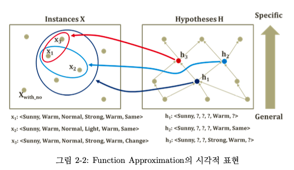
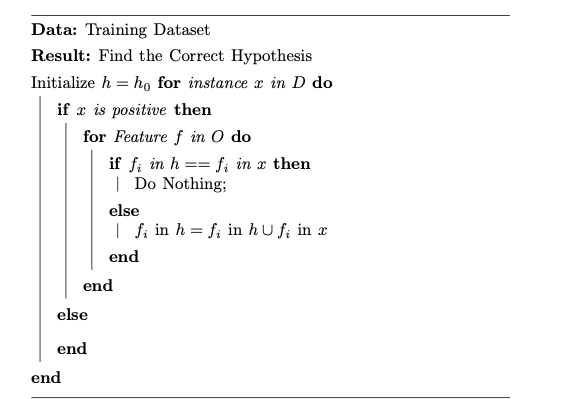
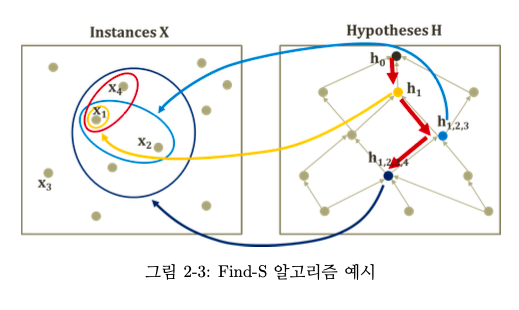
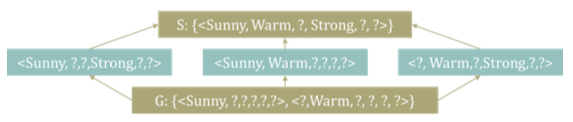
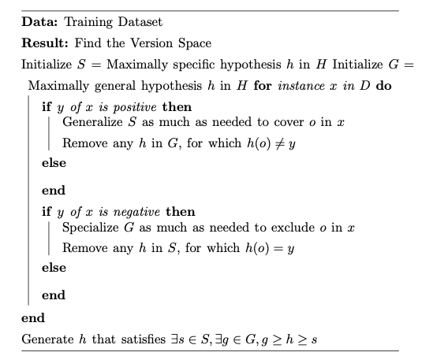
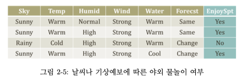
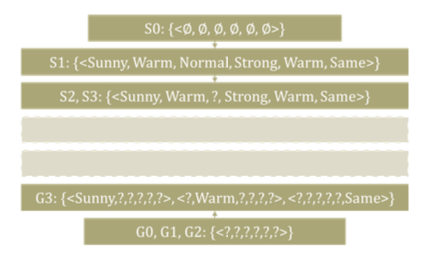
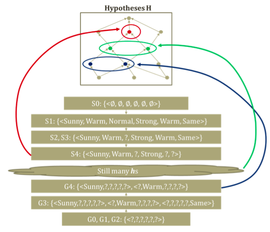
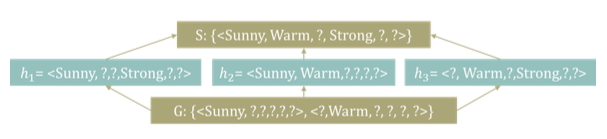

# Fundamentals of Machine Learning

## 1. 규칙기반(Rule-based) 학습

### 1.1 지난 시간 복습
    - 머신러닝이란? 컴퓨터 프로그램이 특정 업무(Task)를 수행함에 있어서, 평가지표(Performance Measure)가 경험을 통해 개선된다면 이를 "프로그램이 학습한다!"라고 말할 수 있음
    - 더 많은 경험을 쌓고, 더 많은 데이터를 분석하고, 더 많은 사전 지식을 갖는다면 머신러닝의 성능은 점점 좋아질 수 있음

---

### 1.2 규칙기반 학습을 위한 가정
#### No observation errors, no inconsistent observations
    관측에러나 비일관적인 데이터는 존재하지 않음 
#### No stochastic elements in the system we observe
    확률적으로 영향을 주는 어떠한 Random effect 같은 요소는 존재하지 않음
#### Full information in the observations to regenerate the system
    결과를 예측하기 위한 모든 정보는 주어져야하며, 주어진 데이터로부터 학습하여 얻은 목표함수(Target Function)는 Hypothesis Set에 포함 

| Sky | Temp | Humid | Wind | Water | Forecst | Enjoyspt |
|-----|------|-------|------|-------|---------|----------|
|Sunny| Warm | Normal|Strong| Warm  |  Same   |    Yes   |
|Rainy| Warm | High  |Strong| Warm  |  Same   |    Yes   |
|Sunny| Cold | High  |Strong| Warm  | Change  |    No    |
|Sunny| Warm | High  |Strong| Cool  | Change  |    Yes   |
 

 날씨나 기상예보에 따른 한 가족의 야외 물놀이 여부 데이터 
  

---

### 1.3 Function Approximation
머신러닝이란 주어진 데이터를 잘 설명하는 approximated function을 찾는 과정

    Function Approximation을 이해하기 위한 용어
    - Instance X : 하나의 Example 혹은 관측 집합을 말합니다. 즉 학습에 사용될 데이터
    - Training Dataset D : 학습 데이터란 여러 개의 인스턴스를 모아놓은 집합
    - Hypothesis H : 데이터를 "그럴듯하게" 설명할 수 있는 임의의 함수
    - Target Function c : 목표 함수란 주어진 데이터를 통해 추론하고자 하는 정답

#### 1.3.1 Function Approximation의 시각적 표현

 
- 

- $h_1$ : $\lt$ Sunny, ?, ?,    ?  , Warm,  ?  $\gt$ 모든 인스턴스 $x_1, x_2, x_3$ 를 포함하는 가설 
- $h_2$ : $\lt$ Sunny, ?, ?,    ?  , Warm, Same $\gt$ 인스턴스 $x_2$는 가설 $h_3$을 만족하지 못함 
- $h_3$ : $\lt$ Sunny, ?, ?, Strong, Warm,  ?  $\gt$ 인스턴스 $x_2$는 가설 $h_2$를 만족하지 못함

    따라서 $h_1$과 같이 필요한 조건들이 비교적 적은 가설을 **일반적(General) 가설**이라 하고, $h_3$과 같이 좀 더 많은 조건들이 필요한 가설을 **구체적(Specific)** 가설이라 표현할 수 있음. 즉, **가설이 일반적일수록 Instance Space에서 더 많은 원소를 포함**

--- 
### 1.4 Find-S Algorithm
- Find-S 알고리즘은 가장 specific 가설로부터 시작하여 인스턴스를 거치며 올바른 가설을 찾음 
- 아래 그림과 같이 D 라는 데이터가 있을 때, 모든 인스턴스 x 중에서 x가 만약 positive 라면 모든 feature를 가지고 판단을 하되 가설과 feature 값이 같다면 아무것도 하지 않고, 그렇지 않을 경우에는 새로운 feature 값도 포함을 시켜줌(= 새로운 feature는 합집합이 됨)
- ⭐ **즉, 인스턴스 x에 대해 최대한 만족할 수 있는 가설을 찾는 과정** ⭐
- 

- Instances
  - $x_1$ : $\lt$ Sunny, Warm, Normal, Strong, Warm, Same $\gt$

  - $x_2$ : $\lt$ Sunny, Warm, Normal, **Light**, Warm, Same $\gt$
    - Light라는 새로운 feature 등장 
    - Learner는 새로운 경험을 배우게 됨(포함 시킴) (e.g. strong 하지 않아도 밖에 나감)

  - $x_4$ : $\lt$ Sunny, Warm, Normal, Strong, Warm, **Change** $\gt$
    - e.g. 일기예보가 Change 되어도 밖에 나감 

- Hypotheses
  - $h_0$ : $\lt$ $\varnothing,\varnothing,\varnothing,\varnothing,\varnothing,\varnothing$ $\gt$
  - $h_1$ : $\lt$ Sunny, Warm, Normal, Strong, Warm, Same $\gt$
  - $h_{1,2,3}$ : $\lt$ Sunny, Warm, Normal, ?, Warm, Same $\gt$
  - $h_{1,2,3,4}$ : $\lt$ Sunny, Warm, Normal, ?, Warm, ? $\gt$

    **Find-S 알고리즘 예시**

    

> 🎈 하지만 Find-S 알고리즘은 일관되어있는 가설 또는 데이터라고 가정하기 때문에 일관적이지 않은 가설에 대해서는 적합하지 않으며, specific한 가설을 선택하게 되면 다른 가설들에 대해서는 수렴하지 못한다는 단점 존재

----- 

### 1.5 Version Space
- Find-S 알고리즘을 통해 목표함수를 찾아낸다는 것은 너무 많은 가설들이 존재하고, 이러한 가설들을 효과적으로 줄일 수 없기 때문에 가능한 가설들의 **범위**를 설정하는 것이 필요
- **Version Space, VS** : 주어진 데이터로부터 추론 가능한 모든 가설들의 집합으로 정의 
- **General Boundary, G** : Version Space의 원소들 중에서 가장 일반화된 가설들의 집합
- **Specific Boundary, S** : 가장 구체화된 가설들의 집합 

임의의 가설 $h \in H$에 대해 다음 식이 성립

- $$VS_{H,D} =\{h \in H \vert \exists s \in S,\exists g \in G ,g \geq h \geq s\}$$
- 
- 조건을 세부적으로 나눔, 후보를 제거하는 알고리즘
- y가 positive인 x가 들어오면 S를 x가 포함되로록 Generalization 
- y가 negative인 x가 들어오면 G를 Specialization 

--- 
### 1.6 Candidate Elimination 알고리즘
- 가장 일반적인 가설을 서서히 구체화 시키고, 가장 구체적인 가설을 서서히 일반화시켜 두 가설 사이의 Version Space를 찾아내는 알고리즘
- ⭐ Version Space를 찾기 위해 Candidate Elimination Algorithm을 사용 ⭐
- ⭐ maximally specific 가설을 세우고, maximally general 가설을 세우고 점차 범위를 좁혀나감 ⭐ 
- $S0$: $\lbrace \langle\varnothing, \varnothing, \varnothing, \varnothing, \varnothing, \varnothing\rangle \rbrace$
- $G0$: $\lbrace \langle?, ?, ?, ?, ?, ?\rangle \rbrace$
- 인스턴스의 feature들을 커버 할 수 있을 만큼만 generalization
-  

#### 1.6.1 Candidate Elimination 과정 

#### Candidate Elimination Process 1
  - 4개의 인스턴스를 이용하여 Specific Boundary를 일반화하고 General Boundary를 구체화 하는 예제 

    

  - S0과 G0을 초기화 
  - 가장 구체적인 가설이 존재한다면 표에서 첫번째 인스턴스 이용하여 $S_0$을 한 단계 일반화 시켜 $S_1$을 구함 
  - 그 다음, 두번째 인스턴스 $S_1$을 다시 한번 한 단계 일반화 시켜 $S_2$을 구함 
  - 두 인스턴스가 각각 다른 값을 가지는 경우는 "?"로 두어 영향을 받지 않도록 설정
  - 두 인스턴스에서 일치하는 나머지 항목들은 값을 그대로 가져옴
  - EnjoytSport 결과 값이 Positive인 경우는 $G_0$에 영향을 주지 않으므로 $G_1$과 $G_2$는 업데이트 되지 않음 

#### Candidate Elimination Process 2

    

  - 세 번째 인스턴스와 같이 밖에 안나가는 경우 Negative Case는 $S_2$에는 영향을 주지 않으므로 $S_3$은 업데이트 되지 않음(드롭됨)
  - 반면 $G_0$은 항상 밖에 나가는 가설이기 때문에 이러한 negative 인스턴스의 feature에 대해서는 부정하여 $G_0$을 구체화 시켜야함 
  - 따라서 이 인스턴스의 Rainy를 부정하는 Sunny로 $G_0$을 구체화 하거나, Cold or Warm or Same으로 구체화가 필요함 
  - 네 번째 인스턴스는 다시 Positive Case로 돌아옴
  - Sunny, Warm, High, Strong 등 4개 항목은 $S_3$에 영향을 주지 않음을 알 수 있음 하지만 Cool, Change는 기존 인스턴스와 반대되는 값을 가지기에 $S_4$는 "?"로 설정해야함
  - 이는 Change에도 불구하고 Positive Case에 해당하므로 $G_3$에서 $G_4$로 업데이트 

    

#### 1.6.2 How to Classify the Next Instance?

일련의 규칙기반 학습을 통해 위 그림과 같은 Version Space를 얻었다고 가정

- $\langle$ Sunny, Warm, Normal, Strong, Cool, Change $\rangle$
  - 구체적인 가설 만족
- $\langle$ Rainy, Cold, Normal, Light, Warm, Same $\rangle$
  - 일반적 가설 불만족 
- $\langle$ Sunny, Warm, Normal, Light, Warm, Same $\rangle$
  - 목표함수에 따라 결과가 달라질 수 있기에 Version Space로 판별 불가, 더 많은 데이터로 학습 필요

#### 1.6.3 Candidate Elimination 알고리즘의 효용성

> - 🎈 관측한 항목 외에 결과에 영향을 미칠 수 있는 항목들이 존재할 수도 있고, 관측 오차 등 Noise가 있을 수 있음
> - True function h가 오차를 포함한 데이터에 의해 필터링 될 수 있음 
> - 그렇다면 Noise를 포함하고 있는 데이터를 이용하여 목표함수를 찾아낼 방법은 없을까?
> - 답은 **Decision Tree!**