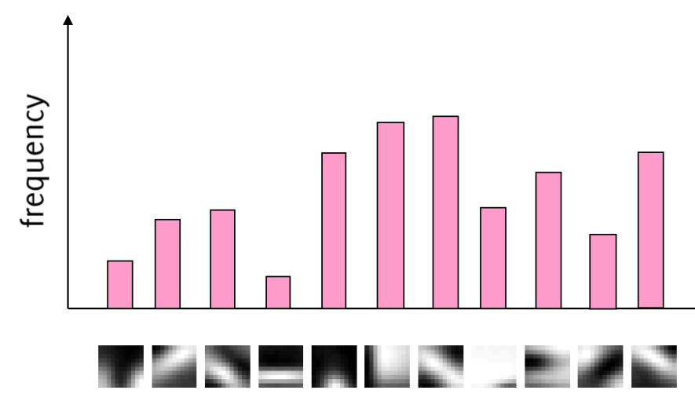

## Naive Bayes Classifier 

### MLE, MAP
- MLE와 MAP는 확률모델을 이용하여 어떤 변수(Θ)를 추정하는 방법
- Maximum Likelihood Estimation(MLE)
  - Likelihood probability(우도) P(X|Θ)가 최대가 되는 어떤 변수(Θ)를 찾는 방법
- Maximum A posterior Probability(MAP)
  - A posterior probability(사후확률) P(Θ|X)가 최대가 되는 어떤 변수(Θ)를 찾는 방법

### Optimal Classification
- x 라는 값이 관측 되면 y = 0 일 확률과 y = 1 일 확률을 계산하는 과정 
- $f^*$ = $argmin_{f}P(f(x) \neq  Y)$
- $f^{*}(x)$ = $argmax_{Y=y}P(Y=y | X =x)$

### Optimal Classification and Bayes Risk
- classification error를 줄일 수 있는 곡선을 구해야함
  - Decision Boundary 곡선 외 부분 

### Learning the Optimal Classifier
- Optimal Classifier 
  - Class Conditional Density, Class Prior로 이루어짐 
  - Prior : P(Y=y)
  - Likelihood : P(X_i = x_i | Y = y)

### Naive Bayes Classifier 
- Conditional Independence를 도입해야함 
- 모든 x는 독립이라고 가정, $P(X, Y) = P(X)P(Y)$
  - 독립적이지 않다면 $(2^d-1)k$개의 많은 파라미터를 계산해야함 
  - 독립적이라면 $(2-1)dk$개의 파라미터들을 가짐 
- 즉, 개별 input feature인 x들은 독립적이라고 가정하고 classification을 수행하는 것 
  - 나이브하게 계산 하는 것

### Conditional vs. Marginal Independence
- x가 다른 x에 의해 영향을 받는다면 Marginal Independence
- x가 다른 x와는 상관 없이 결과 값을 가진다면 Conditional Independence 인 것
- conditional independent assumption을 적용한다면 개별 feature들의 곱셈으로 연산이 변형됨

### Naive Bayes Classifier
- assumption is naive
- d개의 conditionally independent feature x 데이터세트가 있을 때 likelihood를 계산 할 수 있음

### Problem of Naive Bayes Classifier
- 1. Naive assumption
  - 현실적이지 않음
- 2. Incorrect Probability Esitmations
  - MLE는 관측되지 않은 정보라면 제대로 동작하지 않기 때문에 MAP로 다루어야함 
    - 한번도 등장하지 않은 데이터라면 결과가 0이 됨

### Application
- e.g. Text Mining
- e.g. Bag Of Words
  - 하나의 텍스트를 수치적인 정보로 변환해주는 과정 
    - vector <1, 0, 0, 1>
    - word list <I, cool, led, reliant>
  - 예시 
    - Bag of words
      - 198 documents, 29717 unique words 
    - Classes
      - Positive
      - Negative

#### Bag Of Feature
- BOF는 이미지의 특징을 나타내는 방법
- 특징 추출 과정에서 이미지 특징의 상대적인 순서가 손실되기 때문에 bag 이라는 용어 가 사용
- 학습 데이터로부터 이미지의 특징을 추출하고, 학습 이미지에서 추출된 descriptor 들을 클러스터링 한 다음, 각 특징(Visual Word)의 빈도 수를 구함 
  - 특성들은 SIFT나 SURF와 같은 영상 특징점(keypoint) 추출 알고리즘에 의해 결정되기도 하고, 간단히 이미지 지역 패치로 결정함
  -  특성들 중에는 상당히 유사한 것들이 존재할 것이다. 따라서 특성들 중에서 비슷한 것들을 하나로 모아주기 위해 k-means와 같은 군집(clustering) 방법을 사용 
- 
- 참고하면 좋을 사이트 1 : https://www.mathworks.com/help/vision/ug/image-category-classification-using-bag-of-features.html
- 참고하면 좋을 사이트 2 : https://ai.stackexchange.com/questions/21914/what-are-bag-of-features-in-computer-vision
- 참고하면 좋을 사이트 3 : https://bskyvision.com/475

#### Laplace Smoothing
- 훈련 데이터에 없던 값이 들어오거나 이상값이 들어올 경우 그에 대한 우도가 0이 되어, 정상적인 분류가 되지 않을 경우를 막기 위해 사용
- 가중치 a를 통해 스무딩의 정도를 정함
- α는 주로 0.5 또는 1을 사용
- 라플라스 스무딩을 이용하면 특정 특징 X에 대한 우도가 0이 될 일이 없음 
- 즉, 실제로 관찰한 것보다 한번씩 더 봤다고 가정 하는 것