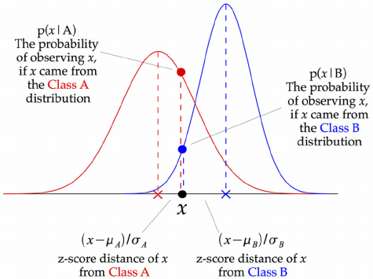

## Bayes 
  - 새로운 정보 $P(B|A)$와 사건의 사전 확률 $P(A)$가 주어졌을 때 어떤 사건이 일어날 확률
  - $P(A \mid B) = \frac{P(B \mid A)P(A)}{P(B)}$
---

## Naive Bayes Classifier
  - 머신러닝에서 Bayes 이론을 Classification에 적용한 것이 Naive Bayes Classifier
    - 직관적인 방법을 사용
    - 작은 양의 데이터에서 사용 가능
    - 학습과 예측에 계산 비용이 적게 듦
  - $P(y|x_1, ..., x_j) = \frac{P(x_1, ..., x_j|y)P(y)}{P(x_1, ..., x_j)}$
    - $P(y|x_1, ..., x_j)$
      - 사후 확률(posterior)
      - 샘플의 $j$개 특성값 $x_1, ..., x_j$가 주어졌을 때 이 샘플이 클래스 $y$에 속할 확률 
    - $P(x_1, ..., x_j|y)$
      - 클래스 y가 주어졌을 때 샘플의 특성 값 $x_1, ..., x_j$의 가능도(likelihood)
    - $P(y)$
      - 사전 확률(prior)
      - 데이터를 보기 전에 클래스 y의 확률에 대한 확실성
    - P($x_1, ..., x_j$)
      - 주변 확률(=개별 사건의 확률)
  - Bag of Words
    - 

  - Naive Bayes에서 가능한 각 클래스에 대해 샘플의 사후 확률을 비교 
  - 비교를 진행하는 동안 주변 확률이 일정하기 때문에 각 클래스에 대한 사후 확률의 분자를 비교
  - 각 샘플에 대해 사후 확률의 분자가 가장 큰 클래스가 예측 클래스 $\hat{y}$가 됨 

--- 

## Naive Bayes Classifier 종류
- 특성의 성질(연속형, 범주형,이진 등)에 따라 분포를 선택 가능
- **특정 확률 분포를 이용하여 확률 계산**
- **데이터에 있는 각 특성에 대해 likelihood의 통계적 분포 $P(x_{j}|y)$를 가정**

- 다양한 Naive Bayes 
  - Gaussian Naive Bayes (1979)
  - Multinomial Naive Bayes (1961)
  - Complement Naive Bayes (2003)
  - Bernoulli Naive Bayes (1998)
  - Categorical Naive Bayes (2006)

----

## Gaussian Naive Bayes
- feature가 연속형 변수일 때 가장 널리 사용하는 방법
- 따라서 모델을 만들 때 데이터가 가우시안 분포(Gaussian Distribution)를 따른다고 가정
- Gaussian Distribution
  - 
- 클래스 $y$의 샘플이 주어졌을 때, 특성값 x의 likelihood가 다음과 같은 정규분포를 따른다고 가정
- 
  -  
- 여기서 $\sigma_{y}^{2}$와 $\mu_{y}$는 클래스 y에 대한 특성 $x_j$의 분산과 평균
- 
  - 모든 데이터 포인트에서 해당 포인트와 각 클래스 평균 사이의 z-score를 계산하여 판단
  - z-score = $Z= \frac{X-\mu}{\sigma}$
  - 즉 클래스의 평균으로부터 거리를 해당 클래스의 표준 편차로 나눈 값으로 계산 
- 정규분포로 가정했기 때문에 Gaussain Naive Bayes 방법은 특성이 모두 연속적인 경우에 적용하기 알맞음 
- Naive Bayes Classifier는 target class에 대한 사전 확률을 지정 가능 

--- 

## Multinomial Naive Bayes
- 이산적인 특성이나 범주형 데이터가 주어졌을 때 사용하는 **다항분포**를 이용한 방법
- Gaussian Naive Bayes와 비슷하게 작동하지만 특성이 다항 분포라고 가정
- Multinomial Naive Bayes가 가장 많이 사용되는 경우 중 하나는 BoW(bag of words) 즉, 단어를 벡터 수로 나타내는 문제  
- 
- relative frequency(상대 빈도) 계산 
- $\hat{\theta_{yi}} = \frac{N_{ui}+\alpha}{N_y + \alpha n}$
  - 각 클래스 $y$를 위한 vector $\theta_y = (\theta_{y1}, ..., \theta_{yn})$에 의해 매개변수화
  - 여기서 $n$은 feature 수(e.g. 텍스트 분류에서는 어휘의 크기)
  - $\theta_{yi}$는 클래스 $y$에 속하는 샘플에 나타나는 feature $i$의 확률 $P(x_i|y)$
  - 매개변수 $\theta_y$는 maximum likelihood의 smoothed version으로 추정
  - $N_{yi} = \sum_{x\in T}x_i$는 training set $T$의 클래스 $y$ 샘플에 feature $i$가 나타나는 횟수 
  - $N_y = \sum_{i=1}^{n}N_{yi}$은 class $y$를 위한 모든 feature의 수
  - 추가로 smoothing priors $\alpha$는 learning sample에 존재하지 않는 feature를 위해 적용하여 데이터를 완만하게 만들어줌, $\alpha \geq 0$으로 정의되고, 확률이 0이 됨을 방지
    - $\alpha = 1$ : Laplace smoothing
    - $\alpha < 1$ : Lidstone smoothing이라고 함
    - alpha가 크면 더 완만해지고, 모델의 복잡도는 낮아짐. 
    - alpha에 따른 성능 변동은 비교적 크지 않아서, 이 값이 성능 향상에 크게 기여하지 않음 
    - 그러나 이 값을 조절하면 어느정도 정확도를 높일 수 있다고 함 

---

## Complement Naive Bayes
- Multinomial Naive Bayes를 불균형 데이터에 맞게 수정한 알고리즘
- 각 클래스의 complement statistics을 사용하여 모델의 가중치를 계산
  - 즉, 불균형 데이터를 균형 데이터로 맞추기 위해 가중치를 사용 
- Complement NB에 대한 매개변수 추정치가 Multinomial NB 보다 안정적임을 실험
- 또한 텍스트 분류 작업에서 Multinomial NB의 성능을 능가함 
- 가중치 계산 절차는 다음과 같음 
  - 기본식에 각 $N$마다 가중치를 적용하여 밸런스를 맞춤
  - 
  - 여기서 $\sum$은 클래스 c에 없는 모든 document $j$에 대한 것이고, $d_{ij}$는 document $j$에 있는 term $i$의 갯수 값, $\alpha_i$는 Multinomial NB에서 적용하였던 smoothing hyperparameter이고 $\alpha$는 $\sum_{i}\alpha_i$ 
- 두번째 정규화는 Multinomial NB에서 longer document가 매개변수 추정치를 지배하는 경향을 해결
  - $\hat{c} = argmin_{c}\sum_{i}t_i w_{ci}$
- 
  - https://people.csail.mit.edu/jrennie/papers/icml03-nb.pdf

---

## Bernoulli Naive Bayes
- 이진 특성을 가진 데이터가 주어졌을 때 사용하는 방법
- 모든 특성이 두 종류의 값만 발생할 수 있는 이진 특성이라고 가정(e.g. one-hot encoding 된 순서가 없는 범주형 특성)
- Multinomial Naive Bayes와 비슷하게 텍스트 분류에 주로 사용
- 이러한 특성 행렬은 한 문서에 어떤 단어가 등장하는지 여부를 담음
- 추가적으로 smoothing을 적용할 수 있는 매개변수 alpha 값이 존재
- 
- $P(x_i \mid y) = P(i \mid y) x_i + (1 - P(i \mid y)) (1 - x_i)$
  - 이는 클래스 $y$에 대한 지표인 feature $i$에 대해 non-occurrence(비발생)이 일어나면 명시적으로 패널티를 부과
    - Multinomial NB는 발생하지 않는 feature를 그냥 무시
- 텍스트 분류 문제의 경우 word count vector가 아닌 word occurrence vector를 사용

--- 

### Categorical Naive Bayes
- 범주형(Categorical)으로 분산된 데이터에 대한 Categorical NB 알고리즘  
- index $i$를 나타내는 각 feature에는 고유한 Categorical Distribution이 있다고 가정
- traing set $X$의 각 feature $i$d에 대해 Categorical NB는 클래스 $y$를 조건으로 하는 $X$의 각 feature $i$에 대한 범주형 분포를 추정 
- 샘플의 index set은 $J$ = {1, ..., $m$}으로 정의되며, $m$은 샘플의 수를 나타냄 
- 클래스 $c$에서 feature $i$의 category $t$의 확률은 다음과 같이 추정 
- $P(x_i = t \mid y = c \: ;\, \alpha) = \frac{ N_{tic} + \alpha}{N_{c} + \alpha n_i}$
  - 여기서 $N_{tic}$ = |{$j \in J \mid x_{ij} = t, y_j = c$}|는 category $t$가 클래스 $c$에 속하는 샘플 $x$에 나타나는 횟수 
  - $N_{c} = |\{ j \in J\mid y_j = c\}|$는 클래스 c가 있는 샘플 수
  - $\alpha$는 smoothing parameter
  - $n_i$는 사용가능한 featre category의 수
- Multinomial NB와의 차이점 : MNB는 단순 범주형 변수, Categorical NB는 범주형 변수는 확률이 있는 범주의 값을 취함 
  - Multinomial features
  - 
  - Categorical features
  - 

---

### Further

- Classifier Comparison
- 
  - Nearest Neighbors / Linear SVM / RBF SVM / Gaussian Process / Decision Tree / Random Forest / Neural Net / AdaBoost / Naive Bayes / QDA 
- 
- [Logistic Regression vs Naive Bayes](https://www.educba.com/naive-bayes-vs-logistic-regression/)

---

### References
- 파이썬을 활용한 머신러닝 쿡북 - 한빛미디어
- 파이썬 라이브러리를 활용한 머신러닝 - 한빛미디어
- https://yeong-jin-data-blog.tistory.com/entry/%EB%82%98%EC%9D%B4%EB%B8%8C-%EB%B2%A0%EC%9D%B4%EC%A6%88-Naive-Bayes
- https://scikit-learn.org/stable/modules/naive_bayes.html
- https://github.com/remykarem/mixed-naive-bayes#related-work
- http://ainotes.agateteam.org/index.php/2020/07/08/multinomial-naive-bayes-classifier/
- https://people.csail.mit.edu/jrennie/papers/icml03-nb.pdf
- https://web.stanford.edu/~jurafsky/slp3/4.pdf
- http://i.stanford.edu/pub/cstr/reports/cs/tr/79/773/CS-TR-79-773.pdf
- http://www.cs.cornell.edu/courses/cs4780/2018sp/lectures/lecturenote05.html
