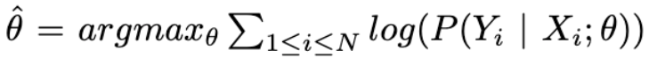
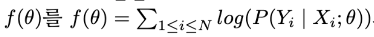

## Logistic Regression

### Decision Boundary 
- 아래 그림에서 $P(Y=y|X) = P(Y = y|X)$가 만나는 지점
- 모델이 라벨을 예측하는 값이 바뀌는 부분 
- 

### Logistic Function 
- Logistic Function
  - $f(x) = \frac{1}{1+e^{-x}}$
  - derivative를 쉽게 계산 할 수 있음
    - 이것은 어떤 의미가 있는가. 미분할 때 편함. 
- Sigmoid
  - Decision Boundary를 결정하는데 효과적 
  - 
  - $f(x) = \frac{e^{\beta_0+\beta_1x}}{1+e^{\beta_0+\beta_1x}}$
  - Bounded (함수 값이 특정 범위 내에 있는 형태)
  - Differentiable (곡선이 부드러운 형태)
  - Real function
  - 모든 input에 대해 정의가 되어있어야 함
  - with positive derivative (단조 증가하는 미분 가능 형태)

### Gradient Method
- $\theta$를 최적화하려면 Approximation 해야함
  - Gradient Method 필요 
- Taylor Expansion(테일러 전개)
  - 특정 조건을 만족시키는 함수를 지역적 특성(Local Properties)을 이용하여 근사(Approximation)하는 방법
  - 한 점에서 함수값 및 n차 미분계수 값을 이용하여 해당 함수와 비슷한 다항함수를 만드는 것
  - 무한번 미분 가능하며 수렴이 전제된다면 이 함수를 무한급수의 형태로 나타낼 수 있음
  - $f(x) = f(a) + \frac{f^{'}(a)}{1!}(x-a)$ + $\frac{f^{''}(a)}{2!}(x-a)^{2}$ + ... 
    = $\sum_{n=0}^{\infty}$
    $\frac{f^{n}(a)}{n!}(x-a)^n$
  - Tayler Expansion은 무한 번 미분가능한 함수에 대해 적용하게 되는데, 이렇게 Smooth한 함수에 대해 경사법(Gradient Descent Method)을 사용할 수 있음 
- Gradient Descent/Ascent
  - 경사법은 미분가능한 함수 $f(x)$에 대하여, 주어진 위치 $x_1$에서 시작해서 이 점을 점점 이동시키며 함수값이 증가 또는 감소하도록 하는 방법
  - 함수 값이 변화하는 방향을 어떻게 찾을 것인가?
    - 어디로 갈지의 "방향"이 필요함
    - 얼마만큼의 "속력"으로 갈지도의 정보가 필요함
    - 속력은 늦더라도 방향이 맞으면 언젠가는 목표로 갈 수 있음
    - 속력은 사람이 정할 수 있도록 하고, 방향은 프로그램이 찾도록 함 
  - 경사법은 어떤 원리에 의해 작동하는가?
    - $f(x) = f(a) + \frac{f^{'}(a)}{1!} + O(|x-a|^2)$
    - Big O notation을 이용하여 차수가 2이상인 항을 모두 묶고, $a = x_1, x = x_1 + hu$로 둠, 여기서 u는 방향벡터를, h는 변하는 속력을 의미함 
    - 다시 말하자면 아래와 같이 나타냄
      - $f(x_1 + hu) = f(x_1) + hf^{'}(x_1)u + h^2O(1)$
      - $f(x_1 + hu) - f(x_1) = hf^{'}(x_1)u$
      - h가 큰 값이라면 위와 같이 정리할 수 없고, h가 0.1 이라면 h square는 0.001이 되기 때문에 매우 작은 수가 됨. h를 매우 작은 수로 둔다면 h square는 더 작게 만들어지기 때문에 0과 유사함. 그래서 $h^2O(1)$ 이 부분은 없앨 수 있는 것
      - $u* = argmin_u\left\{ f(x_1 + hu) - f(x_1)\right\}$
  
        = $argmin_uhf^{'}(x_1)u$

        = $- \frac{f^](x_1)}{|f^{'}(x_1)|}$
      - 방향은 위와 같이 증가하거나 감소하도록 할 수 있음
      - $f(x_1 + hu) - f(x_1)$이 최소화되려면 해당 값이 음수, $f(x_1 + hu)\leq f(x_1)$가 성립해야함
      - 따라서 함수값이 감소하는 방향인 것을 알 수 있고, 그 중 경사 방향과 정반대, 또는 음의 방향으로 이동한다면 가장 효율적으로 함수 값을 감소시킬 수 있음
      - 따라서 다음 점의 좌표 $x_{t+1}$을 다음과 같이 업데이트 해야함
      - $x_{t+1} <- x_t + hu^* = x_t - h \frac {f^{'}(x_1)}{|f^{'}(x_1)|}$
      - 즉, MCLE를 찾기 위해 다음의 조건을 만족시키는 매개변수 $\theta$의 값을 찾아야 함
      - 
        위 경사법을 적용하기 위하여 
      -  와 같이 정의 
      - 최초 매개변수 $\theta_1$ 값을 임의로 설정하고, 이 점의 좌표를 서서히 움직이면서 함수 $f(\theta)$의 값이 증가하도록 만들며, 이 때 Gradient Ascent를 이용하여 경사 방향으로 움직이도록 설정 